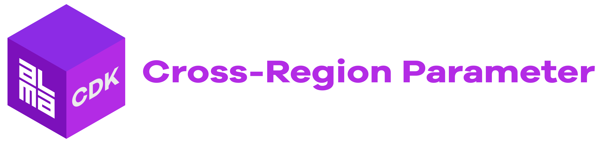
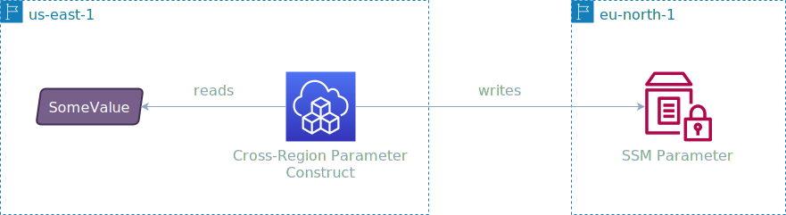

<div align="center">
	<br/>
	<br/>
  <h1>
	
  <br/>
  <br/>
  </h1>

  ```sh
  npm i -D @alma-cdk/cross-region-parameter
  ```

  <div align="left">

  Store [AWS SSM Parameter Store](https://docs.aws.amazon.com/systems-manager/latest/userguide/systems-manager-parameter-store.html) Parameters into another AWS Region with AWS CDK.

  </div>
  <br/>
</div>


<br/>

<div align="center">



</div>

<br/>

## Work in Progress


🚧 &nbsp;**Do not use for production critial stuff! This construct is still very much work in progress and breaking changes may occur.** 🚧


<br/>

## Getting Started

```ts
import { CrossRegionParameter } from "@alma-cdk/cross-region-parameter";

new CrossRegionParameter(this, 'SayHiToSweden', {
  region: 'eu-north-1',
  name: '/parameter/path/message',
  description: 'Some message for the Swedes',
  value: 'Hej då!',
});
```
