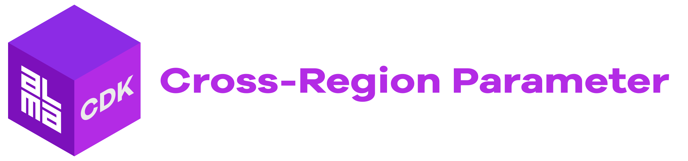
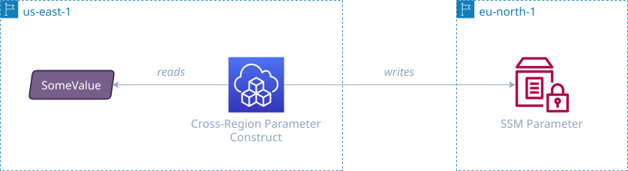

<div align="center">
	<br/>
	<br/>
  <h1>
	
  <br/>
  <br/>
  </h1>

  ```sh
  npm i -D @alma-cdk/cross-region-parameter
  ```

  <div align="left">

  Store [AWS SSM Parameter Store](https://docs.aws.amazon.com/systems-manager/latest/userguide/systems-manager-parameter-store.html) Parameters into another AWS Region with AWS CDK.

  </div>
  <br/>
</div>


<br/>

<div align="center">



</div>


<br/>

## Prefer native CDK/CloudFormation features

> [!IMPORTANT]
> Since CloudFormation's [`Fn::GetStackOutput`][whats-new] (May 2026) and `aws-cdk-lib@2.254.0`, CDK passes values across regions natively — no custom resources, no SSM round-trip. **For most use cases you no longer need this package.**
>
> 📖 [AWS What's New][whats-new] · [AWS DevOps Blog][blog] · [Deep dive by @pahud][devto]

`Fn::GetStackOutput` resolves values inside CloudFormation at deploy time. Reach for
`CrossRegionParameter` only when you genuinely need **an SSM Parameter to exist in the target
region** — because it is read at runtime by an application, by another account or tool, or by
infrastructure that isn't part of this CDK app.

[whats-new]: https://aws.amazon.com/about-aws/whats-new/2026/05/aws-cloudformation-cdk-stack/
[blog]: https://aws.amazon.com/blogs/devops/simplify-cross-account-and-cross-region-stack-output-references-with-aws-cloudformation-and-cdks-new-fngetstackoutput/
[devto]: https://dev.to/pahud/fngetstackoutput-how-cloudformation-and-cdk-solved-cross-region-references-together-9f8


<br/>

## Getting Started

```ts
import { CrossRegionParameter } from "@alma-cdk/cross-region-parameter";

new CrossRegionParameter(this, 'SayHiToSweden', {
  region: 'eu-north-1',
  name: '/parameter/path/message',
  description: 'Some message for the Swedes',
  value: 'Hej då!',
});
```
